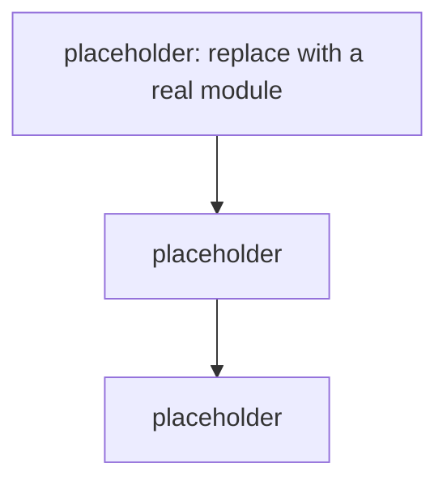

## Overview

<!-- Which layers / modules make up the system, and their responsibilities. -->

## Module graph

## Constraints

<!-- Hard constraints that shape the architecture: performance, dependencies, deployment form, etc. -->
