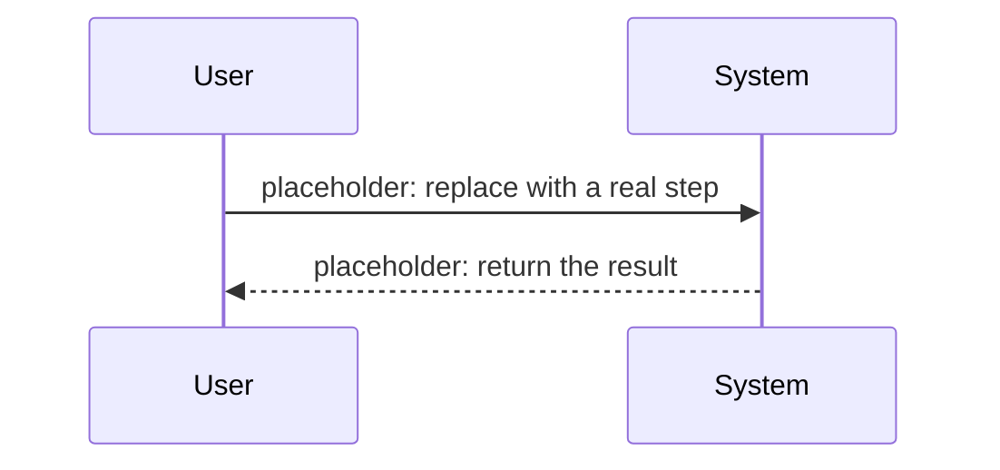

## End-to-end path of a typical request

<!-- Describe the full path of a typical request / operation, from entry to exit. -->

## Other important flows

<!-- List the remaining flows worth pinning down. -->
